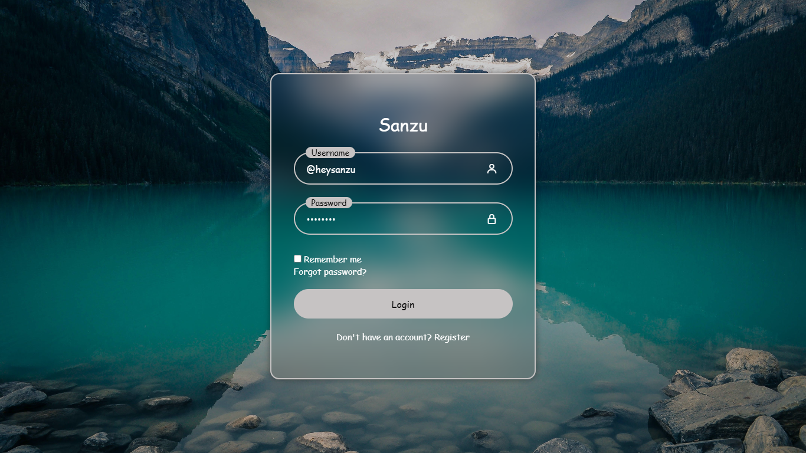

## Login Page
A modern, responsive login interface featuring a glassmorphism design, custom CSS animations, and a clean user experience.

<p align="centre">
  
</p>

### Features:
* **Glassmorphism UI**: Uses `backdrop-filter: blur` to create a frosted glass effect over a background image.
* **Animated Input Fields**: Labels transition and shrink when fields are focused or contain valid text.
* **Responsive Design**: Fully optimized for mobile devices using CSS Media Queries.
* **Custom Styling**: Utilizes the 'Comic Sans MS' font family for a unique aesthetic and a grayscale-focused color palette.
* **Icon Integration**: Powered by Boxicons for intuitive visual cues in the username and password fields.

### Project Structure:
* `index.html`: The structural layout of the login form, including links to external icons and the stylesheet.
* `style.css`: Contains all styling logic, including CSS Variables (`:root`), flexbox layouts, and responsive breakpoints.
* `bg.jpg` (Required): The background image used for the full-page layout.
* `sanzu.png` (Required): The favicon used for the browser tab.

### Setup & Usage:
1. **Clone or Download**: Save the `index.html` and `style.css` files into the same directory.
2. **Add Assets**:
* Place a background image named `bg.jpg` in the root folder.
* Place an icon named `sanzu.png` in the root folder.
3. **Launch**: Open `index.html` in any modern web browser.

### Customization:
You can easily modify the look of the page by editing the CSS Variables in the `style.css` file:

```css
:root {
    --primary-color: #c6c3c3; /* Border and label background */
    --second-color: #ffffff;  /* Text and links */
    --black-color: #000000;   /* Focused label text */
}
```
### Technical Notes:
* **Flexbox**: The `.wrapper` class uses Flexbox to keep the login box perfectly centered both vertically and horizontally.
* **Floating Labels**: Achieved using the CSS sibling selector (`.input-field:focus ~ .label`).
* **Dependencies**: This project requires an internet connection to load the [Boxicons](https://boxicons.com/) library via CDN.
---
Credit: `heysanzu`
